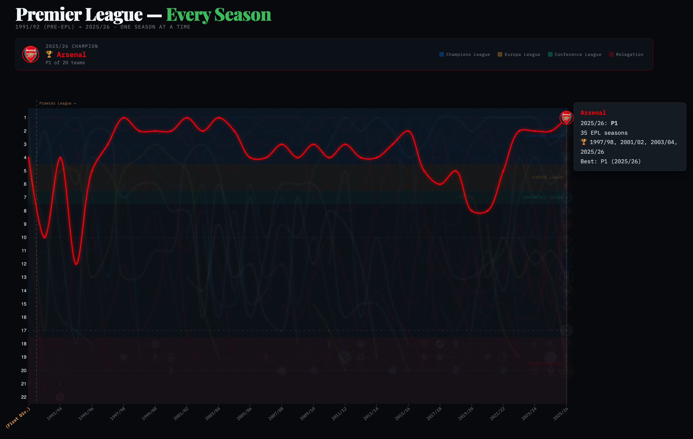
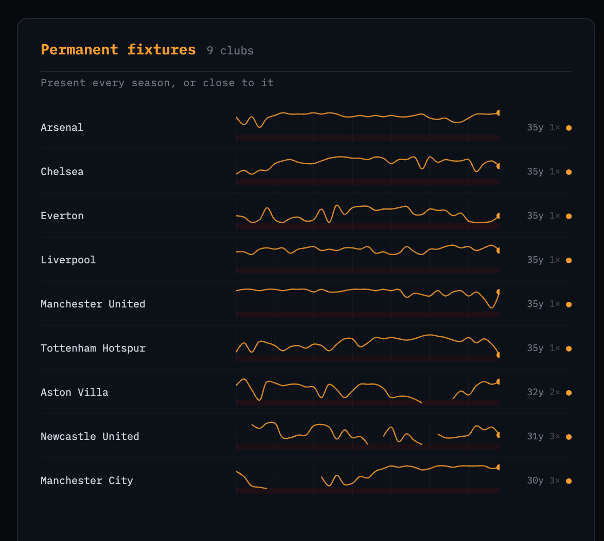

# EPL League Positions — 1991/92 to 2025/26

An interactive bump chart tracking every club's finishing position across all 34 English Premier League (EPL) seasons. In total, 35 seasons are shown with the last season of the First Division that preceded the EPL's formation used as the chart's point. Additionally, there is a k-means cluster analysis grouping the 52 clubs by trajectory type. 

**[→ View the chart](https://kpolimis.github.io/epl-standings/)**
**[→ View the cluster trajectories](https://kpolimis.github.io/epl-standings/trajectories.html)**
**[→ Blog post](https://kivanpolimis.com/posts/blog/epl-standings/)** · **[→ Technical tutorial](https://kivanpolimis.com/posts/technical/epl-clustering-tutorial/)**






---

## What it shows

- Every club that has played in the Premier League (52 clubs across 34 seasons)
- Highlighted clubs rendered in their club colours with crests
- Relegation zone (bottom 3) and European qualification zones shaded
- Hover any line to see that club's full history: seasons played, titles, best and worst finish
- Four trajectory clusters derived from k-means: permanent fixtures, yo-yo regulars, modern era entrants, EPL tourists

## Seasons covered

| Period | Teams |
|--------|-------|
| 1991/92 (First Division) | 22 teams |
| 1992/93 – 1994/95 | 22 teams |
| 1995/96 – 2025/26 | 20 teams |

2025/26 standings reflect the final table (May 2026).

---

## Quickstart

```bash
git clone https://github.com/kpolimis/epl-standings
cd epl-standings
pip install -r requirements.txt     # numpy, scikit-learn, matplotlib, pytest

python fetch_standings.py           # fetch verified standings → data/standings_verified.json
python generate.py                  # build chart → index.html
python generate_trajectories.py     # build cluster viz → trajectories.html

open index.html
```

`generate.py` and `fetch_standings.py` use only the standard library. `requirements.txt` covers the cluster scripts, `elbow_analysis.py` (matplotlib), and the test suite (pytest).

## File structure

```
epl-standings/
├── fetch_standings.py           # Fetch verified standings from two sources
├── generate.py                  # Build index.html from standings data
├── generate_trajectories.py     # Build trajectories.html (k-means cluster viz)
├── cluster_trajectories.py      # Standalone cluster analysis + printed output
├── requirements.txt             # numpy, scikit-learn
├── index.html                   # Main chart — committed for GitHub Pages
├── trajectories.html            # Cluster visualization — committed for GitHub Pages
├── arsenal-trajectory.png              # Arsenal trajectory (main chart)
├── trajectories-header.png             # Cluster viz title screenshot
├── trajectories-permanent-fixtures.png # Permanent fixtures cluster panel
├── trajectories-yo-yo-regulars.png     # Yo-yo regulars cluster panel
├── trajectories-modern-era.png         # Modern era entrants cluster panel
├── data/
│   ├── standings_verified.json  # Verified standings from fetch_standings.py
│   └── standings.json           # Machine-readable standings (generated by generate.py)
└── README.md
```

## Updating the data

Standings are fetched from two sources by `fetch_standings.py`:

| Source | Seasons | Notes |
|--------|---------|-------|
| [football-data.co.uk](https://www.football-data.co.uk) | 1993/94 → present | Primary. Free, no auth. |
| [jalapic/engsoccerdata](https://github.com/jalapic/engsoccerdata) | 1991/92 + 1992/93 | The two seasons the primary doesn't cover. |

Both sources provide raw match results. Final tables are derived identically using points → goal difference → goals scored. To update for a new season:

```bash
python fetch_standings.py    # re-fetches all seasons including the new one
python generate.py           # rebuilds index.html
python generate_trajectories.py  # rebuilds trajectories.html
```

---

## Data sources

- **Standings:** [football-data.co.uk](https://www.football-data.co.uk) (Joseph Buchdahl) + [jalapic/engsoccerdata](https://github.com/jalapic/engsoccerdata) for 1991/92–1992/93
- **Club logos:** [Wikimedia Commons](https://commons.wikimedia.org) — sourced via Wikipedia REST API and direct SVG links. Logos belong to their respective clubs and are used for identification only.

## Tech stack

- Python 3 (stdlib) — data fetching, table derivation, HTML generation
- numpy + scikit-learn — k-means cluster analysis
- [D3.js v7](https://d3js.org) — SVG rendering and interactions
- [Playfair Display](https://fonts.google.com/specimen/Playfair+Display) + [IBM Plex Mono](https://fonts.google.com/specimen/IBM+Plex+Mono) — typography
- GitHub Pages — static hosting

## Deploying to GitHub Pages

1. Push this repo to GitHub
2. Go to **Settings → Pages → Source → Deploy from branch → `main` / `root`**
3. Chart live at `https://kpolimis.github.io/epl-standings/`

---

## License

Code is MIT. Standings data is factual and not subject to copyright.  
Club logos belong to their respective owners and are used for identification only.
